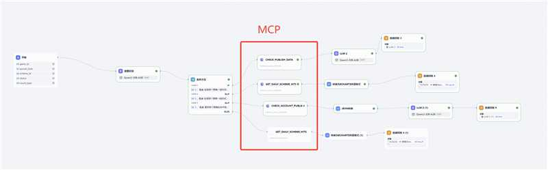
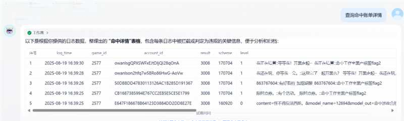
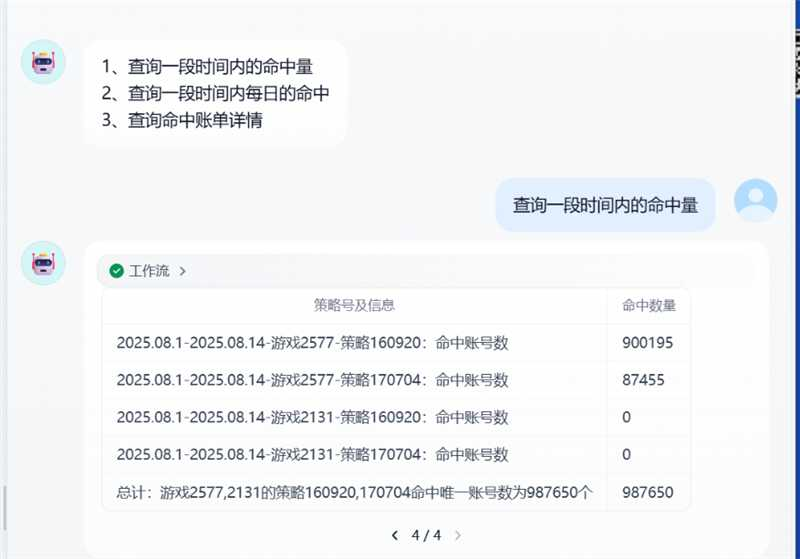
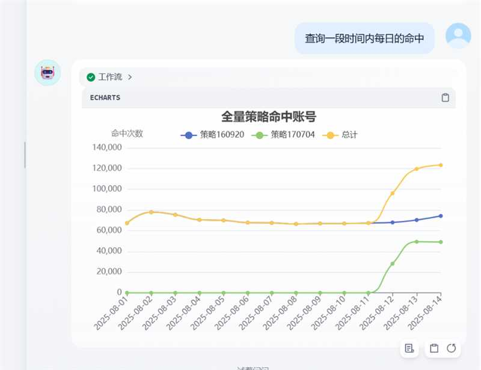

# 策略处罚数据查询 MCP 服务器

## 项目简介

这是一个基于 MCP (Model Context Protocol) 的策略处罚数据查询系统，支持 SSE (Server-Sent Events) 实时通信。该系统可以查询游戏策略的处罚数据，包括命中量统计、每日命中趋势、具体账单信息等。

**作者**: 姚明俊 (mingjunyao)

## 主要功能

- 🔍 **查询策略的命中量** - 支持按条数或账号数统计
- 📊 **策略一段时间的每日命中量** - 提供趋势分析
- 📋 **命中具体账单** - 查看详细处罚记录
- 🎮 **game_id 转 game_name** - 游戏 ID 与名称转换
- 🔄 **多选支持** - 支持多个游戏 ID 和策略 ID 同时查询
- ⏰ **灵活时间格式** - 支持多种时间格式输入

## 系统架构



## 功能演示

### 效果展示一



### 效果展示二



### 效果展示三



## 技术栈

- **框架**: FastMCP + Starlette
- **通信协议**: MCP (Model Context Protocol)
- **实时通信**: SSE (Server-Sent Events)
- **Web 服务器**: Uvicorn
- **数据处理**: Python + JSON
- **HTTP 客户端**: Requests

## 安装依赖

```bash
pip install mcp starlette uvicorn requests
```

## 配置说明

### 服务器配置

- **端口**: 7602
- **主机**: 配置在代码中 (需要修改为实际 IP)
- **调试模式**: 已启用

### 状态字典

```python
status_dict = {
    "全量": [9999999],
    "处罚成功": [0, 5023, 5024, 5025, 5011, 3013],
    "静默": [3006, 3008],
    "灰度": [3007],
    "处罚失败": [999999999998]
}
```

## 使用方法

### 启动服务器

```bash
python mcp_sse.py
```

服务器将在 `http://XX.XX.XXX.XX:7602` 启动

### 主要工具函数

#### 1. 查询策略命中数量

```python
check_publish_data(
    game_id='2577',           # 游戏ID，支持逗号分隔多个
    punish_time='2025.8.12-2025.8.13',  # 时间范围
    scheme_id='170606',       # 策略ID，支持逗号分隔多个
    count_type='条',          # 计算类型：'条' 或 '账号'
    status='全量'             # 状态筛选
)
```

#### 2. 获取每日命中统计

```python
get_daily_scheme_hits(
    game_id='2577',
    punish_time='2025.8.12-2025.8.13',
    scheme_id='170606',
    count_type='条',
    status='全量'
)
```

#### 3. 查询具体账单

```python
get_scheme_bills(
    game_id='2577',
    punish_time='2025.8.12-2025.8.13',
    scheme_id='170606',
    status='全量'
)
```

#### 4. 游戏名称转换

```python
get_game_name_by_id(game_id='2577')
get_game_id_by_name(game_name='XXXX')
```

### 支持的时间格式

- **天数**: `7` (最近 7 天)
- **单日期**: `2025-01-15` 或 `2025.1.15`
- **日期范围**: `2025.1.12-2025.1.15`
- **默认**: 30 天 (当参数为空时)

### 支持的状态类型

- `全量`: 所有状态
- `处罚成功`: 成功处罚的记录
- `静默`: 静默处理的记录
- `灰度`: 灰度测试的记录
- `处罚失败`: 处罚失败的记录

## API 端点

- **SSE 连接**: `/sse`
- **消息处理**: `/messages/`

## 开发说明

### 文件结构

```
├── mcp_sse.py              # 主程序文件
├── 新建 文本文档.txt        # 代码备份
├── 工作流.jpg              # 系统工作流程图
├── 效果一.jpg              # 功能演示截图1
├── 效果二.jpg              # 功能演示截图2
├── 效果三.jpg              # 功能演示截图3
└── README.md               # 项目说明文档
```

### 核心模块

1. **辅助函数模块**: 时间解析、数据处理
2. **查询工具模块**: 策略命中量查询、每日统计
3. **账单模块**: 具体处罚记录查询
4. **游戏信息模块**: 游戏 ID 与名称转换
5. **SSE 服务模块**: 实时通信支持

## 注意事项

1. **网络配置**: 需要修改代码中的 IP 地址为实际服务器地址
2. **权限认证**: 系统使用 token 进行 API 认证
3. **数据限制**: 单次查询最多返回 10000 条记录
4. **时间格式**: 支持多种时间格式，建议使用标准格式

## 更新日志

### 最终版特性

- ✅ 解决了时间新增格式问题
- ✅ 支持策略号多选
- ✅ 支持游戏 ID 多选
- ✅ 优化了数据处理逻辑
- ✅ 完善了错误处理机制

## 许可证

本项目仅供内部使用，请勿外传。

---

**联系方式**: mingjunyao
**最后更新**: 2025 年
